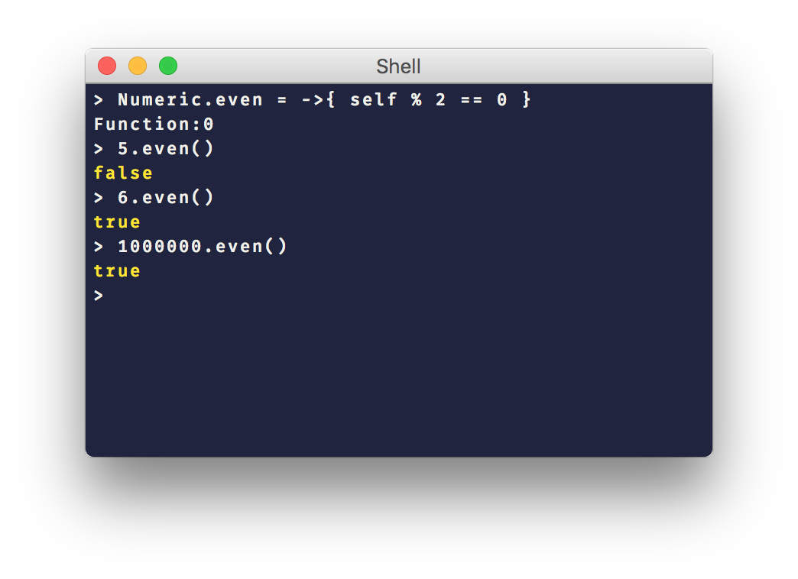

[](https://travis-ci.com/KCreate/charly-lang)
[](https://github.com/KCreate/charly-lang/releases/tag/v0.0.1)
[](https://github.com/KCreate/charly-lang/blob/master/LICENSE)


# The Charly programming language

This is my try at writing an interpreter of a dynamic language from scratch with my bare hands. It is implemented in [Crystal](https://crystal-lang.org/). It is absolutely not production-ready and is meant only for my own learning-purposes.

# Syntax

> All syntax samples are highlighted using the javascript highlighter. Because the two languages have a lot of similarities in their syntaxes, this works out most of the time.

__Declaring a variable__
```javascript
let number = 900
let float = 5.5928
let string = "Hello World"
let boolean = true
let array = [1, "charly", false]
let nullvalue = null
let nanvalue = NAN
let object = {
  let name = "leonard"
  let age = 16
}
```

__Declaring constants__
```javascript
const PI = 3.14159265358979323846
const E = 2.7182818284590451

PI = 4 # Cannot redeclare constant PI
```

__Objects__
```javascript
let Box = {
  let name = "mybox"
}

Box.name # mybox
Box.name = "yourbox"
Box.name # yourbox
```

What you see above is a container literal. A container literal is basically a IIFE whose scope is then turned into an object.

Here is another example of containers

```javascript
const Box = {
  let name = "mybox"
  let type = "Plastic"
  let size = {
    let width = 100
    let height = 80
    let depth = 90
  }
}

Box.name # mybox
Box.type # Plastic
Box.size.depth # 100
```

__Declaring a function__
```javascript
func callback(value, callback) {
  callback(value)
}

let result = callback(25, func(value) {
  value * 2
})

result # => 50
```

You can also use anonymous functions.

```javascript
let myfunc = func() {
  25
}

myFunc() # 25
```

__Lambda functions__

> Lambda functions are just syntactic sugar for anonymous functions. They behave 100% the same. Anonymous functions are functions that don't have a name.

```javascript
const nums = [1, 2, 3, 4, 5]

nums.map(->(n) n + 50) # [51, 52, 53, 54, 55]

nums.map(->25) # [25, 25, 25, 25, 25]

nums.map(->Math.rand()) # [0.346, 0.803, 0.428, 0.046, 0.208, 0.150]

# The above is the same as writing the following
nums.map(func() {
  Math.rand()
})

nums.map(->{
  foo()
}) # ["result of foo", "result of foo", "result of foo", "result of foo", "result of foo"]
```

Lambda functions that don't contain a block, such as `foo(->25)` behave as if the expression after the `->` was placed inside a block. E.g: `foo(->{ 25 })`

__Times & While loops__
```javascript
5.times(->(i) {
  print("Hello")
})

let i = 0
while i < 10 {
  print("In a while loop")
  i += 1
}
```

__User Input__
```javascript
# Strings
let input = "> ".prompt()
print(input)

# Numbers
let input_number = "> ".promptn()
print(input_number)
```

__Primitive types__
```javascript
25.typeof()                           # => Numeric
25.5.typeof()                         # => Numeric
"Charly".typeof()                     # => String
[1, 2, 3].typeof()                    # => Array
null.typeof()                         # => Null
NAN.typeof()                          # => Numeric
false.typeof()                        # => Boolean
(class Box {}).typeof()               # => Class
(func() {}).typeof()                  # => Function
(->() {}).typeof()                    # => Function
{ let name = "charly" }.typeof()      # => Object
```

__Including other files__
```javascript
# Include a file in the current directory
require("foo.charly")
require("./foo.charly")
require("./dir/foo.charly")

# Include the math module from the standard library
require("math")
```

__Working with arrays__
```javascript
let array = [1, 2, 3]
array.push(4)
print(array) # => [1, 2, 3, 4]
print(array[1]) # => 2
```

__Classes & Objects__
```javascript
class Person {
  property name
  property age

  func constructor(name, age) {
    @name = name
    @age = age
  }
}

class AwesomePerson extends Person {
  property awesome_level

  func constructor(name, age, awesome_level) {
    @name = name
    @age = age
    @awesome_level = awesome_level
  }
}

let leonard = Person("Leonard", 16)
print(leonard.name) # "Leonard"
print(leonard.age) # 16
```

You can depend on multiple classes.

```javascript
class Meows {
  func speak() {
    print("Meow...")
  }
}

class Animal {
  property name

  func constructor(name) {
    @name = name
  }
}

class Cat extends Animal, Meows {}

const myCat = Cat("Charly")
myCat.speak()
```

# Extending primitive types

Below is a REPL session that shows how to extend primitive types.

</img>

# Semicolons & Parens

Semicolons are completly optional, but the absence of one can cause undesired or unexpected behavior. A good example of this would be:

```javascript
print("hello world")
[1, 2, 3]
```

The above is parsed as:

```javascript
print("hello world")[1, 2, 3]
```

This won't work as the return value of `print` is `null` and an index expression can only contain a single value.

What you really want is the following:
```javascript
print("hello world");
[1, 2, 3]
```

The following two examples would be evaluated the same way:

```javascript
2 test lol 2 * 2 test ()
```

```javascript
2;
test;
lol;
2 * 2;
test();
```

The parens around If and while statements are optional:

```javascript
if size < 100 {
  # code
}

while !should_exit {
  # code
}
```

__CLI arguments and flags__

You can access flags passed to the interpreter via the global `IFLAGS` array. Flags are stored as a String.
Command line arguments (arguments passed after the filename which are not flags) are available via `ARGV`.

Current environment variables are available via the object `ENV`.

Example:
```
$ charly test.charly 1 2 3 -f ast
```

Will result in:

```javascript
ARGV          # [1, 2, 3]
IFLAGS        # [ast]
ENV["SHELL"]  # /bin/bash
ENV.HOME      # /Users/leonardschuetz
```

# Using the built-in REPL

You can use the arrow keys to navigate the cursor. Up and down will scroll through the history.

```
$ charly repl
> 2 + 2
4
> "test"
test
> $ * 4
testtesttesttest
> func increment(a) { a + 1 }
Function
> increment(25)
26
> print("hello world")
hello world
null
> .exit
```

If you need to pass arguments or flags to a REPL session you can do so via the repl command
```
charly repl these are all arguments
```

```javascript
> ARGV
[these, are, all, arguments]
```

# Everything is an object
When you write `5`, the interpreter actually treats it as a primitive. There are no funny castings or object instantiations. You can normally write code like `2 + 5` and it will work. Once you do something like `5.times(func() {})`, the interpreter searches the function for the given type. If it finds the method, it injects a variable called `self` into the function's stack and executes it.

This allows the interpreter to reuse the same object for all primitives.

This principle applies to all language primitives. The `Array` object for example, specifies a method called `push` which inserts an element into the array.

# Stack layers
Every file, function, class, object etc. gets it's own stack layer. A stack layer is in essence just a Hashmap that has a pointer to it's parent layer. When you write `myname`, the interpreter searches the current layer for a entry for this variable. If it's not found, it searches the parent layer. If a value is not found in this structure, an exception is raised stating `myname` is not defined.

When you execute a file, let's say *foo.charly*, the layer structure looks like this:
```
--------------------  Contains bindings to stdout, stderr, stdin
| Standard Prelude |  and various other functions and primitive classes
--------------------  such as String, Numeric, Object
        ^
        |
        |
--------------------------
| User file (foo.charly) | Contains all values declared within your program
--------------------------
```

Let's assume the content of *foo.charly* is the following
```javascript
func foo(arg) {
  let myval = arg + 1
}

let value = 25
foo(value)
```

The layer structure now looks like this:
```
--------------------------
| User file (foo.charly) |
|                        |
| value: 25              |
| foo: Function          |
--------------------------
            ^
            |
            |
    -----------------
    | Function: foo |
    |               |
    | arg: 25       |
    | myval: 26     |
    -----------------
```

# Behaviour of *self* in methods
The self keyword always points to the object a method was called on. Where the method currently lives is not taken into consideration. Example:
```javascript
let value = 10

let Box = {
  let value = 10

  func foo(new) {
    @value = new
  }
}

# Both the outer value and the value inside Box are set to 10

Box.foo(20)
# Outer *value* is still 10, Box.value is now 20

let foo = Box.foo
foo(50)
# Outer *value* is still 10, Box.value is now 50
```

Instead of writing `self.value` you can write `@value`. It is 100% the same.

If you directly call a method, the interpreter will set *self* to whatever value it was in the scope where the function was defined in. Please note that methods defined in classes are linked with the scope the class is defined in. That's the reason why Box.value was set to 50. It behaves kind of like [Arrow functions in JavaScript](https://developer.mozilla.org/en/docs/Web/JavaScript/Reference/Functions/Arrow_functions). This means you can _"extract"_ functions and they keep working the way you expect them to.

Example showing how extracted class methods work

```javascript
let value = 10

class Box {
  property value

  func constructor() {
    @value = 10
  }

  func set(new) {
    @value = new
  }
}

const myBox = Box()
myBox.set(20)

print(value, myBox.value) # 10 20

const set = myBox.set
set(50)

print(value, myBox.value) # 50 20

```

Example:
```javascript
let Box = {
  let name = "leonard"

  func greet() {
    "Hello " + self.name
  }
}

let greet = Box.greet
print(greet()) # will print Hello leonard
```

This currently only works on objects. If you try to extract a method like *each* from an Array this won't work. It will just result in undefined behaviour.

# Syntax errors
When the interpreter finds a syntax error, it will be nicely presented to you via the following format:

```
test/debug.charly
      1. const buffer = files[i].content
      2. const size = buffer.length()
      3. const offset = size - position
      4.
->    5. if (offset < 25 thisfails) {
      6.
at debug.charly:5:17:9
Unexpected Identifier
```

The offending piece will be highlighted red. If your terminal doesn't support colors, an arrow also points to the offensive part.

# Native crystal extensions
Charly currently has rudimentary support for native extensions written in crystal. The way this works is via crystal files that are compiled directly into the interpreter.

You can add your own files like this:

- Create a file called `myfile.cr` inside `src/charly/interpreter/internals`

- Insert the following code:

```crystal
require "../**"

module Charly::Internals

end
```

- Define your methods like this:

```crystal
require "../**"

module Charly::Internals

  charly_api "mymethod", myarg : TString do
    return TString.new("You said: " + myarg.value)
  end

end
```

- Recompile & reinstall the interpreter

- Link against the method inside your charly program like this:

```javascript
const mymethod = __internal__method("mymethod")

# will print "You said: Hello World"
print(mymethod("Hello World"))
```

- Finished!

# OS Support
I'm developing on macOS 10.12 so it should work without any problems on that.
The [CI Build](https://travis-ci.com/KCreate/charly-lang) runs on Ubuntu 12.04.5 LTS.

# Installation
You will need a working [crystal](http://crystal-lang.org/) installation.

To install the `charly` command and automatically copy it to the `/usr/bin` folder, run `install.sh`.
You will be prompted for your admin password (used to copy to `/usr/bin`).

# CLI options
```
$ charly -h
Usage: charly [filename] [flags] [arguments]
    -f FLAG, --flag FLAG             Set a flag
    -h, --help                       Print this help message
    -v, --version                    Prints the version number

Flags:
    ast                              Display the AST of the userfile
    tokens                           Display tokens of the userfile
    lint                             Don't execute after parsing (linting)
```

# Contributors

[Contributors](https://github.com/KCreate/charly-lang/blob/master/CONTRIBUTORS.md)

# Inspired by
- Javascript
- C
- Ruby

[License](https://github.com/KCreate/charly-lang/blob/master/LICENSE)
