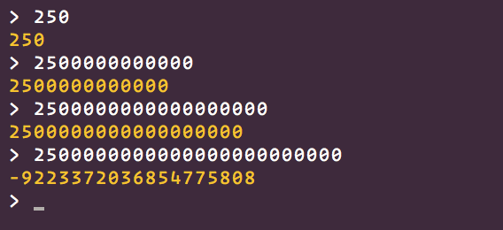

# Charly Language Guide
## Version 0.0.1

Your syntax files need to be encoded in UTF-8.

## Comments
Comments start with the sharp `#` character. Only one-line comments are currently supported.

```javascript
# This is a comment
```

## Literals

Charly has a total of 10 primitive types. Not all can be constructed directly. For example the `TInternalFunction` can only be gathered from a call to `__internal__method`

### Null
The `Null` type can be compared to `undefined` in javascript or `nil` in some other languages.

```javascript
null
```

### Boolean
A `Boolean` only has two different values: `true` and `false`.

```javascript
true
false
```

### Numeric
All Numeric types inside Charly are Crystal's native `Float64` type.

Numeric literals, just like any other expression in the language, can be prefixed with `-` to negate them.

Underscores can be used to make some numbers more readable:

```javascript
1_000_000 # better than 1000000
```

Floats are created using the `.` character.

```javascript
123_456.456_789
```

A Numeric will silently overflow if you pass the lower or upper limit of `Float64`. The following REPL session elaborates this:



Operations such as `1 / 0` will result in the `NAN` value.

### String
A String represents an immutable sequence of UTF-8 characters.

It uses Crystal's native `String` type underneath.

You can create it using `"` characters.

```javascript
"hello world"
```

A backslash can be used to denote various special characters inside the string:

```javascript
"\"" # double quote
"\\" # backslash
"\e" # escape
"\f" # form feed
"\n" # newline
"\r" # carriage return
"\t" # tab
"\v" # vertical tab
```

A string can span multiple lines:

```javascript
"hello
      word" # same as "hello\n     world"
```

### Array
An Array is a resizeable list of items of any type. It is typically created with an array literal:

```javascript
[1, 2, 3]
[1, "hello world", ["whats up"]]
```

You can add new items to an array using the push method:

```javascript
let nums = []
nums.push(0)
nums.push(1)
nums.push(2)

nums # [0, 1, 2]
```

You can concat two arrays together via the `+` operator:

```javascript
[1, 2] + [3, 4] # [1, 2, 3, 4]
```

You can compare two arrays using the regular `==` operator:

```javascript
[1, 2, 3, 4] == [1, 2, 3, 4] # true
[1, 2] == [3, 4] # false
```

### Objects

Charly doesn't have special syntax to create objects. Instead it uses something we call `Containers`.

A `Container` is basically the scope of a block turned into an Object:

```javascript
let Box = {
  let name = "charly"
  let age = 200
}

Box.name # "charly"
Box.age # 200
```

This can be compared to the javascript equivalent of using `new Function()`:

```javascript
let Box = (new function() {
  this.name = "charly"
  this.age = 200
})

Box.name // "charly"
Box.age // 200
```

You can access properties of objects via `[]`:

```javascript
let Box = {
  let name = "mybox"
}

Box["name"] # "mybox"
```

### Functions

You can define a new function like this:

```javascript
func foo() {
  return "hello world"
}
```

When written inside a block as a top-level-expression, it is automatically rewritten to the following:

```javascript
let foo = func() {
  return "hello world"
}
```

If you only need the function literal, you can use anonymous function literals:

```javascript
func foo(callback) {
  callback(42)
}

foo(func(arg) {
  print(arg) # 42
})
```

There is also the lambda syntax, which goes like this:

```javascript
[1, 2, 3].map(->(num) {
  print(num)
})

[1, 2, 3].map(->(num) print(num))
```

Of course you could also pass the print method directly, this would however result in the following:

```javascript
[1, 2, 3].map(print)

# 1
# 0
# 3
# 2
# 1
# 3
# 3
# 2
# 3
```

Because `Array#map` passes the value, index and size of the array to the callback, print will write all these values to the console.

When you write a lambda function without parenthesis or curly braces, it will wrap the expression inside a block.

The following:

```javascript
foo(->25)
```

becomes:

```javascript
foo(->{ 25 })
```

which in turn get's converted to:

```javascript
foo(func() {
  return 25
})
```

### Classes

Classes in Charly can inherit from multiple other classes.

They can have instance methods and properties and also static methods and properties.

Below is an example of a simple `Person` class.

```javascript
class Person {
  property name
  property age
  property height

  func constructor(name, age, height) {
    @name = name
    @age = age
    @height = height
  }

  func greet() {
    print("My name is " + @name)
    print("I am " + @age + " years old")
    print("I am " + @height + " cm tall")
  }
}

let John = Person("John", 21, 1.85)
John.greet()

# Will print
#
# My name is John
# I am 21 years old
# I am 1.85 cm tall
```

You define properties via the `property` keyword followed by an identifier.

To define a static method or property, prefix the property or func keyword with the `static` keyword.

```javascript
class Box {
  static property count

  static func foo() {
    "class method"
  }
}
Box.count = 0

Box.foo() # "class method"
```

To inherit from other classes, you use the `extends` keyword.

```javascript
class Foo {
  func foo() {
    "foo method"
  }
}

class Bar {
  func bar() {
    "bar method"
  }
}

class Baz extends Foo, Bar {
  func baz() {
    "baz method"
  }
}

let myBaz = Baz()
myBaz.foo() # "foo method"
myBaz.bar() # "bar method"
myBaz.baz() # "baz method"
```

Static properties and methods are also copied to the child classes. The values of static properties are copied by value. They are not references.

```javascript
class Foo {
  static property foo

  static func what() {
    "static what"
  }
}
Foo.foo = "test"

class Bar extends Foo {}

Bar.what() # "static what"
Bar.foo # "test"

Foo.foo = "hello world"

Bar.foo # "test"
```

## `self` reference

`@test` will be rewritten to `self.test` by the parser automatically.

The `self` reference always points to the object a method was called on.

```javascript
let myBox = {
  let name;

  func foo() {
    @name
  }
}

myBox.name = "box"
myBox.foo() # "box"
```

If you directly call a method (`foo()`), `self` is set to whatever it what in the context where the method is defined. Think of it like Arrow Funtions in JavaScript.

```javascript
let Box = {
  let name = "box"

  func foo() {
    return func() {
      print(self.name)
    }
  }
}

let method = Box.foo()
method() # "box"
```

## Assignments

Assignment is done with the `=` character.

```javascript
# assigns to a local variable
local = 1

# assigns to the current self variable
@instance = 2

# The above is simply rewritten to
self.instance = 2
```

## Control expressions

All control expressions inside charly behave as if they were regular expressions. You can't place them anywhere but they do return a value.

### Truthy and falsey values

A _truthy_ value is a value that is considered true for an `if` and `while` guard. A _falsey_ value is a value that is considered false in those places.

The only falsey values are `false` and `null`. Any other value is _truthy_.

### if statements

The parenthesis around the test expression are optional

```javascript
if (2 < 5) {
  print("Mathematics still works!")
} else {
  print("Something's off...")
}

if 2 + 2 == 9 - 7 {
  print("Mathematics still works!")
} else {
  print("Somethings's off...")
}
```

### while statements

The parenthesis around the test expression are optional

```javascript
while true {
  print("and another one")
}

let i = 0
while i < 100 {
  print(i)
  i += 1
}
```

For simple loops that repeat for a fixed amount of time, you are encouraged to use the `Numeric#times` method.

```javascript
5.times(->(i){
  print(i)
})
```

You can break inside a while statement.

```javascript
let i = 0
while true {

  if i >= 100 {
    break
  }

  print(i)

  i += 1
}
```

## Types and methods

The next sections will assume you know what object oriented programming is, as well as the concepts of classes and methods.

### Everything is an object

Everything in Charly is an object. Not every type can have an internal state however. Only `Object`, `Class`, `PrimitiveClass` and `Array` can have an internal state.

When you write `5`, the interpreter actually treats it as a primitive. There are no funny castings or object instantiations (inside charly). All values inside charly are boxed in heap memory. When you write `5.times`, the interpreter searches for a primitive class called `Numeric` and checks if it contains a method called `times`.

This allows the interpreter to reuse the same object for all primitives of the same type.

This principle applies to all language primitives. The primitive class `Array` for example, specified a method called `push` which inserts an element into the array.

### Method arguments

If a method expects to be called with 2 arguments, you have to pass two. If you pass 1 it throws an exception.

```javascript
func foo(a, b, c) {

}

foo(1, 2, 3) # okay
foo(1, 2, 3, 4) # also okay
foo(1, 2) # 
```

### Operators

You can override any operator inside an object. Just define a method with the corresponding name.

```javascript
class Vector2 {
  property x
  property y

  func constructor(x, y) {
    @x = x
    @y = y
  }

  func __plus(other) {
    Vector2.new(@x + other.x, @y + other.y)
  }
}

v1 = Vector2(1, 2)
v2 = Vector2(3, 4)
v1 + v2 # Vector2(@x=4, @y=6)
```

Overrideable operators are:

- `+` = `__plus`
- `-` = `__minus`
- `*` = `__mult`
- `/` = `__divd`
- `%` = `__mod`
- `**` = `__pow`

- `!` = `__unot`
- `-` = `__uminus`

- `<` = `__less`
- `>` = `__greater`
- `<=` = `__lessequal`
- `>=` = `__greaterequal`
- `==` = `__equal`
- `!` = `__not`

## Exceptions

You can throw exceptions from anywhere in the program. Everything is throwable.

```javascript
func foo(arg) {
  if arg < 10 {
    throw Exception("arg is smaller than 10")
  }
}

foo(5)
```

This will show up in the console as:

```
test/debug.ch
      1. func foo(arg) {
      2.   if arg < 10 {
->    3.     throw Exception("arg is smaller than 10")
      4.   }
      5. }
at debug.ch:3:5:5
at foo (debug.ch:7:1:3)

Uncaught Object:Exception: arg is smaller than 10
```

## Requiring files

You can include other files using the `require` method. It accepts a single string argument that serves as the filename.

When including a file, the contents of the `export` variable is then returned by the `require` call.

Example:

__main.ch__
```javascript
let external = require("./external.ch")
print(external.message) # "hello world"
print(external.foo(1, 2)) # 3
```

__external.ch__
```javascript
export = {
  let message = "hello world"

  func foo(l, r) {
    l + r
  }
}
```

If you call require on the same file twice, it will result the value returned by the very first call.

__main.ch__
```javascript
let external = require("./external.ch")
external.message = "it changed"

let external_second = require("./external.ch")
print(external_second.message) # "it changed"

external == external_second # true
```

__external.ch__
```javascript
export = {
  let message = "hello world"
}
```

Recursive `require` call won't be catched or prevented in any way.
